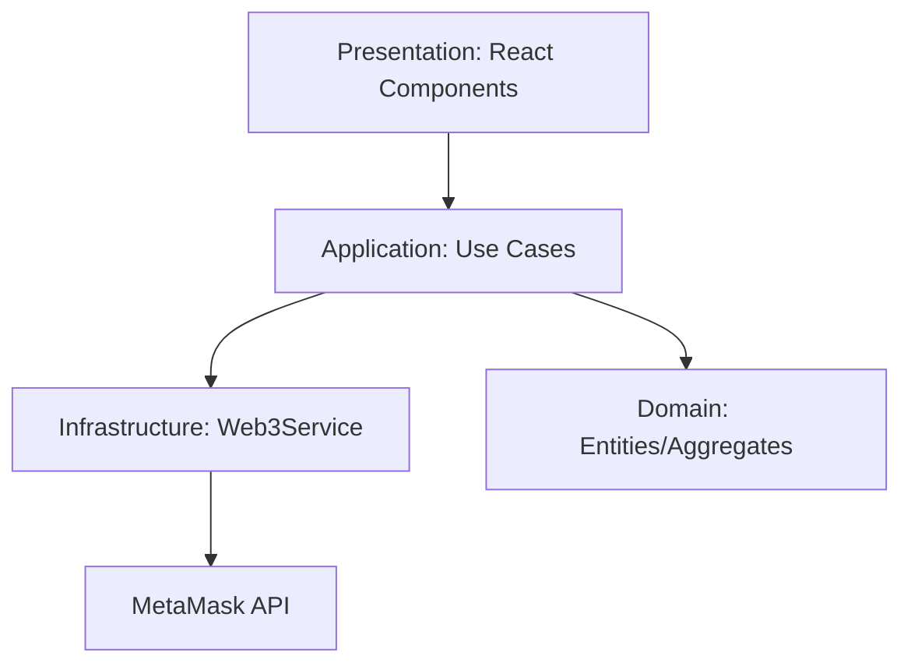

# Diagramas de Arquitetura

```mermaid
graph TD
    UI[Presentation: React Components] --> UseCase[Application: Use Cases]
    UseCase --> Web3Service[Infrastructure: Web3Service]
    Web3Service --> MetaMask[MetaMask API]
    UseCase --> Domain[Domain: Entities/Aggregates]
```

- As dependências sempre apontam para o domínio.
- A UI nunca acessa infraestrutura diretamente.
